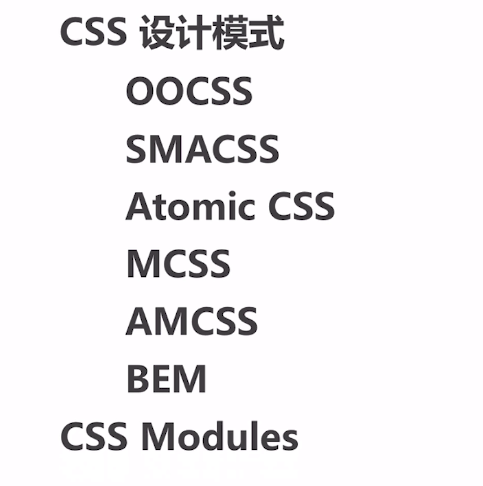
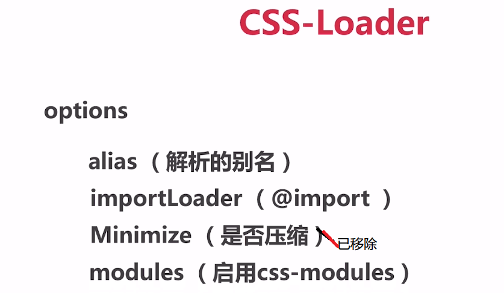
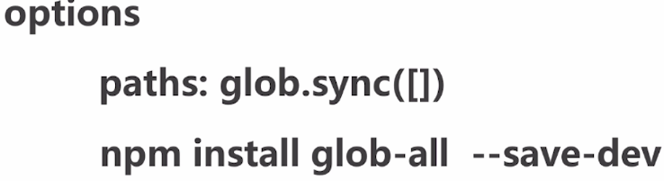

### 基础

1. webpack-dev-server 默认不接受 ip 访问 可以给 package.json 里的 script 中的 dev 配置项加上 --host 0.0.0.0,即可通过 ip 访问，真机通过访问内网 ip，即可访问到项目
2. babel-polyfill,可以为不支持 es6 新特性的浏览器自动转化为适应的 js 版本
3. npm run build:会生成 dist 目录，这就是里面就是要上线的代码,要放在根路径,不放在根路径的话要改变 assetsPublicPath 属性值可以不把上线的代码放在根路径例如'/project1'

### js 模块化

1. ES module es6 支持
2. common js node js 支持‘’

### css 模块化 ‘’



### webpack

> 核心概念

1.  entry :入口
2.  output :出口
3.  loaders :转化模块
4.  plugins :插件

> 名词解释

1. chunk :代码块
2. module :模块
3. bundle :打包好的文件

### loaders

1. 使用 typescript
   

### plugins

1. babel-polyfill babel runtime transform ：给低版本浏览器提供更高的语法支持

2. babe-polyfill :全局垫片 为开发应用做准备 import "bable-polfill"
3. babel runtime transform :可以避免全局污染，和减少文件体积
   

### 代码分割

4. require.insure([模块路径字符串]，回调函数，chunk 名)，实现模块异步加载)
5. require.include(模块路径字符串) \*\*适用于单入口项目，实现异步加载
6. import 动态引入
7. 图示: 

### 处理 css

1. style-loader：创建 style 标签
   > 配置项
   > 
   > 
2. css-loader: import css 引入 css

   > 配置项
   > 
   > ！[css-modules 语法](./img/css-modules语法.png)
   > 配置项: localIdentName:定义 webpack 处理过的 css 名,例子如下
   > ! [localIdentName](./img/css-modules参数.png)

3. MiniCssExtractPlugin,extract-loader(用的人少)):提取 css 为一个文件 OptimizeCssAssetsPlugin：压缩 css 文件（示例在处理 css 中）

4. postcss:用 js 转化 css 的插件,该过程发生在 webpack 的打包过程中

- 使用:cnpm i postcss postcss-loader
- 提示: postcss 需配合其他插件使用
  - autoprefixer: css 兼容
  - cssnano: 压缩 css,MiniCssExtractPlugin 也能实现对应的功能
  - postcss-cssnext:能够使用新语法,包括了 autoprefixer
- 兼容:可以在 package.json 上新建一个 browerslist 的字段，值为数组，或者在根目录下新建.browerslistrc 文件，这样所有的插件都能够读取其中的值,从而实现对应的兼容

5.  tree Shaking:去除无用的代码,包括 css 和 js

    - 使用场景:1. 常规优化, ；2.引用第三方库的某一个功能
    - **js tree Shaking**: webpack 4 会自动压缩 js（某些第三方库除外）,并且没有用到的代码并不会出现在打包的文件当中
    - webpack.optimize.UglifyJsPlugin 已经被移除,需要使用 uglifyjs-webpack-plugin,再配合 babel(示例处理 css 中)

    ```
      在modules的rules里添加以下代码
                { //webpack自身压缩js代码不能解决 某些第三方库tree shaking的问题，要引入另外的loader，来实现tree shaking
                test: /\.js$/,
                use: [{
                    loader: 'babel-loader',
                    options: {
                        presets: ['env'],
                        plugins: ['lodash'] //cnpm i babel-babel-plugin-lodash -S,除此之外还要安装babel-core babel-loader babel-preset-env，如果之前没有安装过这些插件的话

                    }
                }]
            }
    ```

    ```
    optimization同plugins为同级关系，它的意思是优化
        optimization: {
        minimizer: [
            new uglifyjsWebpackPlugin({
                uglifyOptions: {
                    compress: false
                }
            })
        ]
    }
    ```

    - **css tree shaking**
      - purifycss-webpack,webpack 专用的 purify css,可以和 glob-all 一起使用,有它之后可以处理多个路径。
      - css modules 和 css tree shaking 不能一起使用
      - 

### rules

1. rules 下面的 loader 是自下而上执行的
