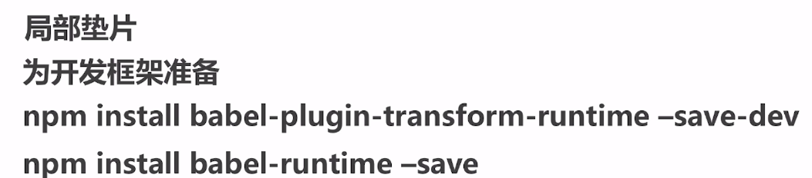
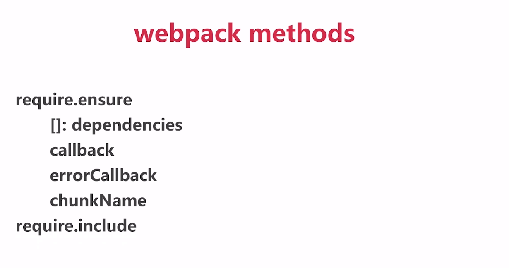
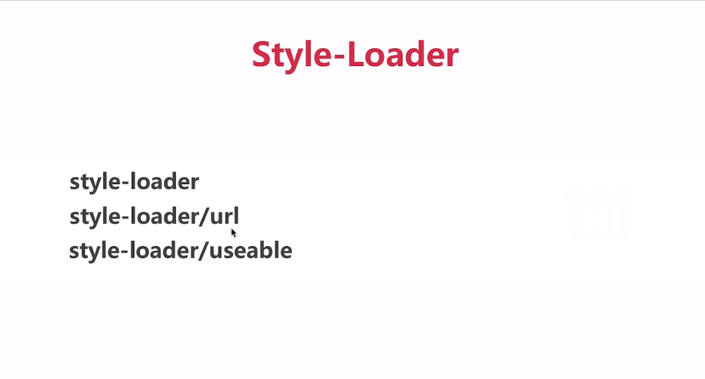
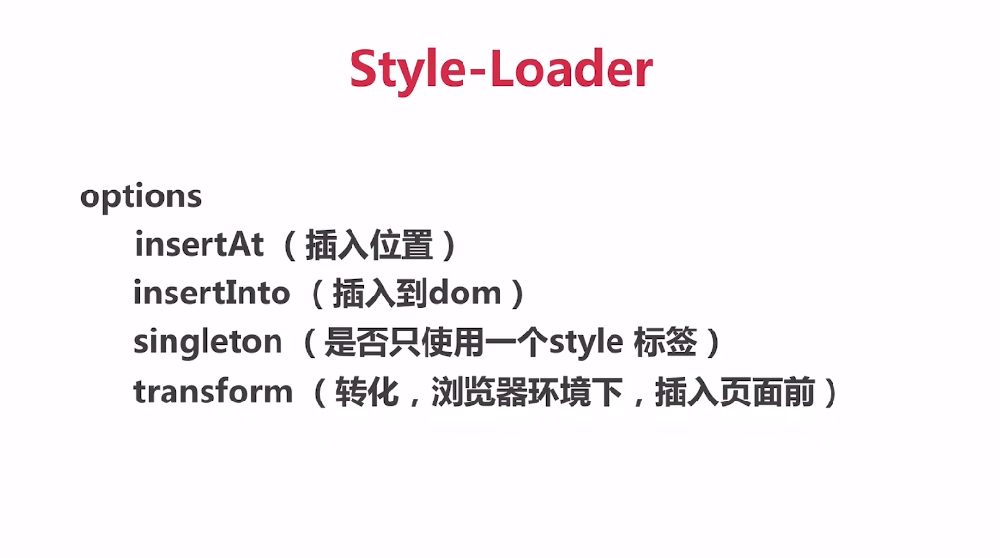

### 基础
1. webpack-dev-server 默认不接受ip访问 可以给package.json里的script中的dev配置项加上 --host 0.0.0.0,即可通过ip访问，真机通过访问内网ip，即可访问到项目
2. babel-polyfill,可以为不支持es6新特性的浏览器自动转化为适应的js版本
4. npm run build:会生成dist目录，这就是里面就是要上线的代码,要放在根路径,不放在根路径的话要改变assetsPublicPath属性值可以不把上线的代码放在根路径例如'/project1'

### js 模块化
1. ES module es6支持
2. common js node js支持‘’

### css模块化  ‘’

### webpack
 >核心概念
 1. entry :入口
 2. output :出口
 3. loaders :转化模块
 4. plugins :插件

>名词解释
1. chunk :代码块
2. module :模块
3. bundle :打包好的文件

### loaders
1. 使用typescript

### plugins

1. babel-polyfill babel runtime transform ：给低版本浏览器提供更高的语法支持

2. babe-polyfill :全局垫片 为开发应用做准备 import "bable-polfill"
3. babel runtime transform :可以避免全局污染，和减少文件体积
  

### 代码分割 
4. require.insure([模块路径字符串]，回调函数，chunk名)，实现模块异步加载)
5. require.include(模块路径字符串) **适用于单入口项目，实现异步加载
6. import动态引入 
7. 图示: 

### 处理css
1. style-loader：创建style标签
> 配置项
 
 
2. css-loader: import css 引入css